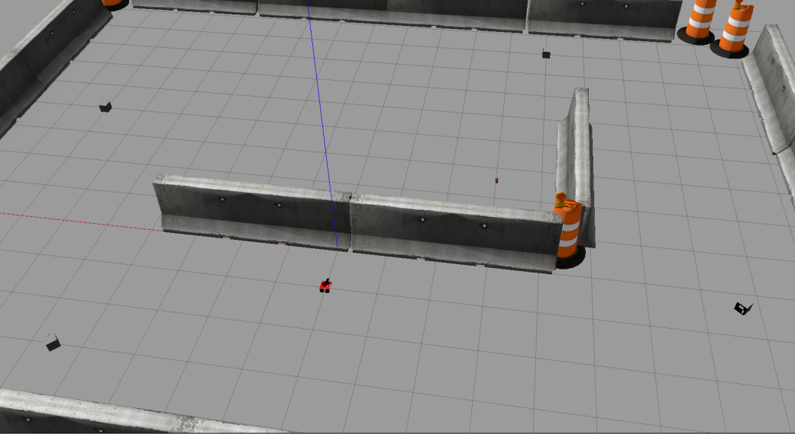
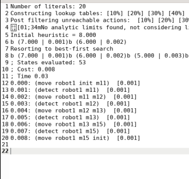

# Experimental Robotics Lab - 2nd Assignment

This repository contains the solution to assignment 2 of the Experimental Robotics Laboratory course, where we were tasked with developing a ROS package that allows a ROSbot, equipped with a camera, to detect markers in the environment and return to its initial position using ROSPlan.

## Group Members:

- DELALA Hocine (5445123)
- GASMI Farouk (5473184)
- MONTANARO Alix (6523574)

## Overview

This repository contains an implementation of an assignment where a robot is tasked to navigate through an environment with Aruco markers. The goal is to make the robot move towards specific markers in a predefined order.



The robot must follow these behaviors:

- Move to position x = 6, y = 2 where Marker 11 is visible, rotate until detecting Marker 11.
- Move to position x = 7, y = -5 where Marker 11 is visible, rotate until detecting Marker 12.
- Move to position x = -3, y = -8 where Marker 11 is visible, rotate until detecting Marker 13.
- Move to position x = -7, y = -1.5 where Marker 11 is visible, rotate until detecting Marker 15.
- Move back to the initial position of the robot. 
  
## Implementation

To implement this task, we had to create the following:
- In the **rosbot_gazebo** package: Configuration files for the world and launch scripts for simulating the robot in Gazebo.
- In the **aruco_ros** package: Modifications to the marker publisher node for detecting Aruco markers and publishing relevant information.
- In the **Rosplan_planning_system** package: The PDDL files and the launch file.
- In the **rosplan_interface** package: This package contains the action interface nodes for the PDDL actions.

### PDDL

For the planning part, we have created the problem and the domain files for our case. In the domain file, we had types and predicates and the following actions:

- The **move** action enables the robot to transition between marker locations (waypoints) within the environment, ensuring it moves from its current location to a specified target while marking the destination as visited.
  
- The **detect** action allows the robot to identify markers at its current location, aiding in the perception and recognition of markers present in the environment.

For the **problem** file:

The problem file represents a scenario within the domain. In this instance, the robot begins at the initial marker location labeled "init" and must navigate through the environment. The goal is to detect markers at four specific locations: "m11", "m12", "m13", and "m15". Additionally, the robot must return to the starting position "init" after detecting all markers. This problem instance encapsulates a task where the robot needs to explore, detect, and navigate back to its initial position, aligning with the defined goal conditions.

### Action Interface

In this part, we have created a package to interface with the ROSPlan system. Header files and action nodes were created. The action nodes corresponding to the PDDL actions are the following:

- **move action interface**:
We created a ROSPlan action interface node that facilitates robot navigation tasks using the move_base package. This node listens for action dispatch messages and determines the destination based on the parameters received. Once the destination is identified, the node sends a navigation goal to the move_base action server, instructing the robot to move to the specified location. After sending the goal, the node waits for the action to be completed before acknowledging the successful execution of the task. In the main function, we initialize the ROS node and instantiate the action interface, allowing it to efficiently process incoming action messages.

The following is the pseudo code of our node:

```bash
class MyActionInterface:

    constructor(node_handle):
        initialize parameters and set up connections
        
    function concreteCallback(message):
        extract destination from the message
        determine destination coordinates based on the destination
        create MoveBaseGoal with target destination coordinates
        create SimpleActionClient for move_base action server
        send a goal to the move_base action server
        wait for the action result
        log success/failure of the action
        return true to indicate action completion

main function:

    initialize ROS node
    create MyActionInterface instance
    run the action interface
```


- **move action interface**:
We've created a ROSPlan action interface node for marker detection, called detect_action. This node listens for incoming marker identification messages on the /marker_id topic and adjusts the robot's behavior accordingly. Upon receiving an action dispatch message, the node determines the expected marker ID based on the action parameters. It then adjusts the robot's movement to align with the expected marker. In the main function, the ROS node is initialized, and the detect_interface instance is created to handle detection actions, ensuring efficient processing of incoming messages.

The following is the pseudo code of our node:


```bash

class Detect_Interface:

    constructor(node_handle):
        initialize parameters and set up connections  
        advertise publisher for robot velocity commands 
        subscribe to marker identification messages
        initialize expected and received marker IDs
    
    function marker_id_Callback(message):
        update marker ID based on received message

    function concreteCallback(message):
        determine expected marker ID based on action parameters
        adjust robot's movement based on received and expected marker IDs
        publish velocity command
        return true to indicate action completion
        
main function:

    initialize ROS node
    create instance of Detect_Interface
    run action interface

```

### Launch files and used packages

- **ROSPlan interface launch file:**
The **interfaced_planning_system** launch file orchestrates the execution of various components within the ROSPlan planning system for task planning and execution. It sets up the necessary parameters and interfaces for planning, including knowledge base initialization, problem generation, planning interface, plan parsing, and plan dispatch. Additionally, it includes configuration for simulated actions, such as movement and detection, which are essential for testing and development purposes. This launch file plays a crucial role in coordinating the planning and execution of tasks within the ROSPlan framework.

  Command to launch it:

    ```bash
    roslaunch rosplan_planning_system interfaced_planning_system.launch
After launching this launch file and calling services (as explained in installing and running part), we generat the following plan :



- **Gazebo environment setup and robot spawn:**
Here we created a launch file `assignment2.launch` that sets up the environment. Additionally, we have used the launch file `rosbot_gazebo.launch` in the rosbot_bringup package to spawn the ROSbot in the environment.

  Command to launch it:

    ```bash
    roslaunch rosbot_gazebo assignment2.launch
    roslaunch rosbot_bringup rosbot_gazebo.launch
    ```
  
  
- **move_base**
We have used the move_base package, which provides an implementation of an action that, given a goal in the world, will attempt to reach it with a mobile base. The move_base node links together a global and local planner to accomplish its global navigation task. We have used this node to make the robot move in the environment.
 
- **Gmapping**
We have also used the gmapping package, which provides laser-based SLAM (Simultaneous Localization and Mapping), as a ROS node called slam_gmapping. Using slam_gmapping, you can create a 2-D occupancy grid map (like a building floorplan) from laser and pose data collected by a mobile robot.

 To install the Gmapping package, we use the following command:
 
    ```bash
    sudo apt-get install ros-noetic-openslam-gmapping
    ```

* **Marker publisher node**:
For marker detection, we modified the marker publisher node in the aruco_ros package. The modifications enable the retrieval of marker information ID. This information is published on the following topics:
`/marker_id`: A topic that contains the ID of the detected marker.


## Installing and Running

### Simulation Environment

1. Create and build a catkin workspace using the following command:

    ```bash
    mkdir -p ~/<name of the workspace, let say assignment2_ws>/src
    ```

2. Source your bashrc by adding the following line at the end of the bashrc file.

    ```bash
    source /where_your_workspace_is/devel/setup.bash
    ```

3. Clone these packages inside the /src of your workspace, using:

    ```bash
    cd /../assignment2_ws/src
    git clone https://......git
    ```

4. Build the workspace:

    ```bash
    cd ~/assignment2_ws/
    catkin_make
    ```

5. Run the command :
    ```bash
    roscore 
    ```
6. Now you have everything installed and ready to launch. We have created the following launch files inside the `rosbot_gazebo` and `rosplan_planning_system` packages:

    - The first will launch the gazebo world (The robot and the markers), and the marker publisher node, also the move_base and gmapping laucnh files. We named it `assignment2.launch`.
    - The second one will launch the rosplan system, it is called `interfaced_planning_system.launch`.

    ```bash
    roslaunch rosbot_gazebo environment.launch
    roslaunch rosplan_planning_system interfaced_planning_system.launch
    ```
    
7. After launching these files now time to start problem generation, planning, and plan dispatch. For these services we can simply run the following ros commands:
```bash

rosservice call /rosplan_problem_interface/problem_generation_server
rosservice call /rosplan_planner_interface/planning_server
rosservice call /rosplan_parsing_interface/parse_plan
rosservice call /rosplan_plan_dispatcher/dispatch_plan
```

We should expect that the robot will start moving and performing the task.


### Real Robot

1. For the real robot, first, we need to connect it to a screen, mouse and typing board, so we can launch the nodes and do the configurations.
2. Connect the robot to a network, then check the IP address using `ifconfig`, then change the IP address in the .bashrc file.
3. Clone your packages in the `husarion_ws`.
4. Catkin_make for the `husarion_ws`.
5. Launch the required nodes:

    ```bash
    roslaunch tutorial_pkg all.launch
    roslaunch rosbot_gazebo gmapping.launch
    roslaunch rosbot_gazebo move_base.launch
    roslaunch rosplan_planning_system interfaced_planning_system.launch
    ```
After launching these files now time to start problem generation, planning, and plan dispatch. For these services we can simply run the following ros commands:
```bash

rosservice call /rosplan_problem_interface/problem_generation_server
rosservice call /rosplan_planner_interface/planning_server
rosservice call /rosplan_parsing_interface/parse_plan
rosservice call /rosplan_plan_dispatcher/dispatch_plan
```


